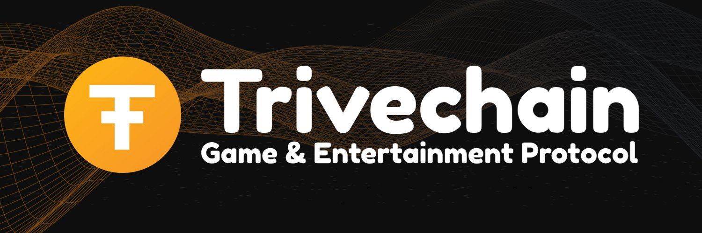

# Introduction

## Game & Entertainment Protocol

Trivechain started in 2018 as a fork of DASH allowing everyone to have instant send with Assets embedding, we have achieved tokenization of Fungible Asset \(FA\) and Non-Fungible Asset \(NFA\). Now that the adoption of script-based blockchain has slowed down. In March 2021, with the consensus of the TRVC community, we have decided to migrate to BSC so our developers can work on smart contract state-based blockchain. 

We have successfully migrated to Binance Smart Chain \(BSC\) in May 2021. On BSC, we will be working on tools to help game developers to store their games asset on blockchain easier. There are many things planned out in the roadmap session so feel free to read them.

## Key Features

#### 👛 Expansion of Wallet to be compatible with BSC

An easy to use [wallet](https://wallet.trivechain.com) provides our community with tools that are most used within the TRVC ecosystem.

#### 🚜 Yield Farming

An incentive should be given to users holding TRVC and providing liquidity. Besides, we will also work on Auto Compounding pools from other protocol to ensure that TRVC could be seen by others. Priority should be given to projects in the games and entertainment protocol.

#### 🗳Decentralised Autonomous Vehicle \(DAO\)

DAO will be used to make decisions in terms of the block reward and other important decision

#### 😇 NFT Creation

We will be launching our very own NFT called the TRVCHI, tokenomic of TRVCHI will be updated during the launching of TRVCHI

#### 🏪 NFT Marketplace

We will be providing a marketplace for everyone to trade their game assets and NFT

#### 🔐 Commit Blockchain

We might not be able to reach here but we will try our best to grow our community and groom projects. When there are many blockchain games in our community, we will be creating a blockchain where TRVC governance could become the validators of this blockchain on BSC and the block hash are recorded on BSC giving the finality of the blockchain transactions. And the aim should be to keep the fees low so that games could store their information on-chain instead of off-chain


Trivechain started as a fork of Dash in the year 2018 March. Migration to BSC happened on May 2021. So, you might find some information that might be inaccurate compared to the current version


